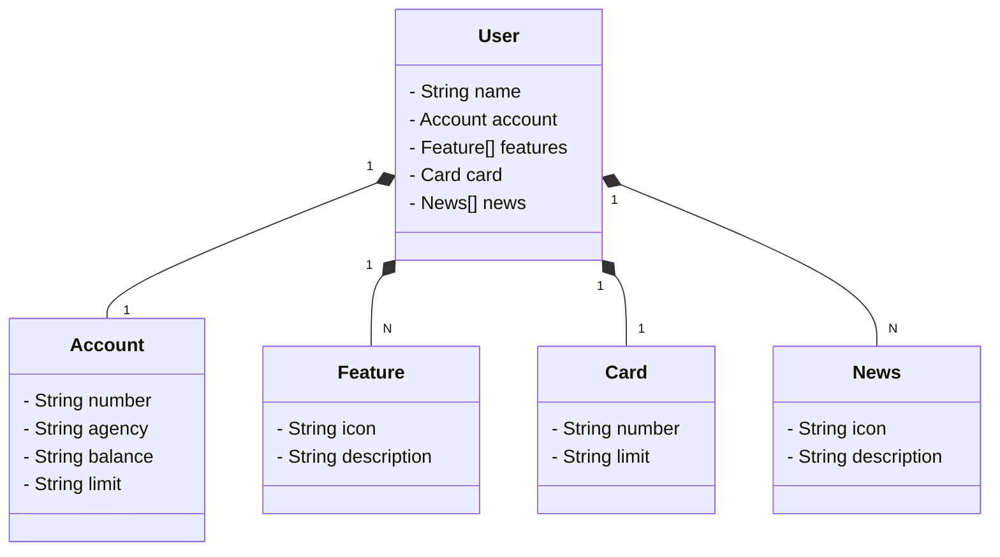
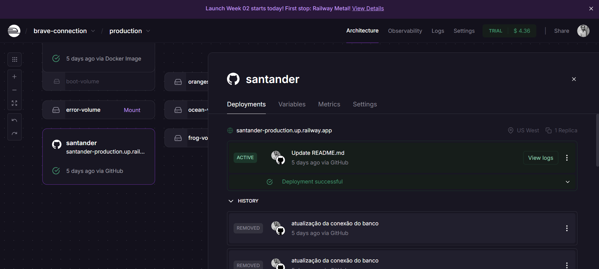
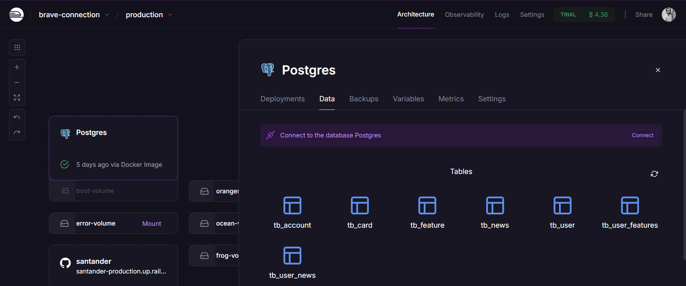
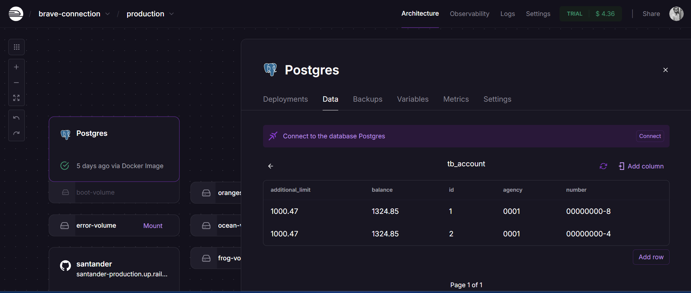
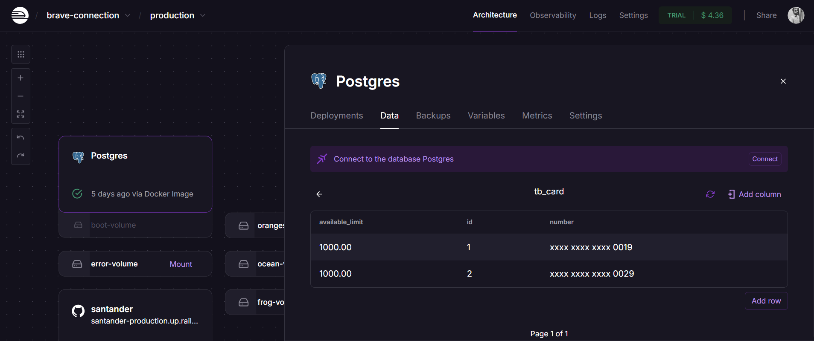
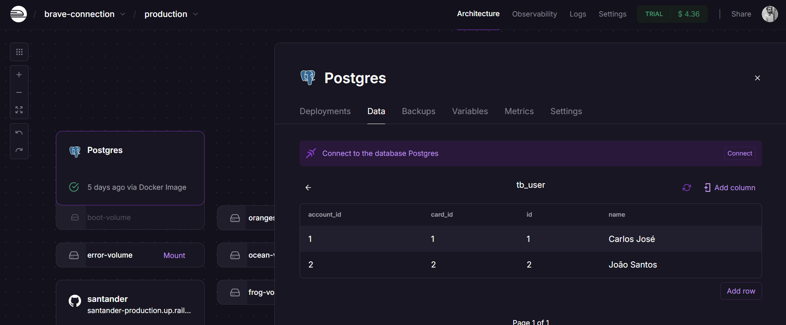

# Santander Dev Week 2023
RESTful API da Santander Dev Week 2023 construída em Java 17 com Spring Boot 3.

## Principais Tecnologias
 - **Java 17**: Utilizei a versão LTS do Java;
 - **Spring Boot 3**: Trabalhei com essa versão do Spring Boot, conforme solicitado em video aula explicativa do projeto;
 - **Spring Data JPA**: Explorei essa ferramenta pois ela simplifica a camada de acesso aos dados, facilitando a integração com bancos de dados SQL;
 - **OpenAPI (Swagger)**: Criar uma documentação de API eficaz e fácil de entender usando a OpenAPI (Swagger), perfeitamente alinhada com a alta produtividade que o Spring Boot oferece;
 - **Railway**: Facilita o deploy e monitoramento de nossas soluções na nuvem, além de oferecer diversos bancos de dados como serviço e pipelines de CI/CD.

## [Link do Figma](https://www.figma.com/file/0ZsjwjsYlYd3timxqMWlbj/SANTANDER---Projeto-Web%2FMobile?type=design&node-id=1421%3A432&mode=design&t=6dPQuerScEQH0zAn-1)

O Figma foi utilizado para a abstração do domínio desta API, sendo útil na análise e projeto da solução.

## Diagrama de classes

## Documentação da API (Swagger)

### [https://sdw-2023-prd.up.railway.app/swagger-ui.html](https://santander-production.up.railway.app/swagger-ui.html)

Esta API ficará disponível no Railway por um período de tempo limitado.

## Print da tela da aplicação em funcionamento

- --------------------------------------------------------

- --------------------------------------------------------

- --------------------------------------------------------

- --------------------------------------------------------

